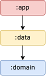

# MovieBox App

This is the guide about how this app was developed
The app was developed with latest modern android development :
- ***Kotlin***
- ***Modularization***
- ***Clean Architecture pattern***
- ***Hilt - Dependency Injection***
- ***Coroutines***
- ***Flow***
- ***Paging3***
- ***Room***
- ***Version Catalog***
- ***Android Min SDK: 24***
- ***Android Target SDK: 33***

## Android App Architecture - Guideline to Modularization

**Top tip**: A module graph (shown above) can be useful during modularization planning for
visualizing dependencies between modules.

The MovieBox app contains the following types of modules:

* The `app` module - contains app level, presentation layer and scaffolding classes that bind the rest of the codebase,
  such as `MainActivity`, `MyApplication` and dependency injection. The `app` module depends on `data` module and
  required `domain` module.

* `data:` module - contains operation about accessing or manipulating data both network nor local.
  This module depend on `domain` module, but it should’t depend on app module.

* `domain:` module - most deep layer that contains all business logic for each specific usecase, such as `IMovieRepository` etc. This module not depend to any module, because this is the deepest layer based on Clean Architecture guidelines.

## Main Features
- Show all popular movie and cached to database
- Show all favorites movie
- choose favorite movie
- search movie based on title
- Show detail movie
- Pagination on review list

## Credits
- **Dimas Arya Murdiyan** - dimasaryamurdiyan123@gmail.com
- [TMDB API - Free Movie API](https://developer.themoviedb.org/reference/intro/getting-started)